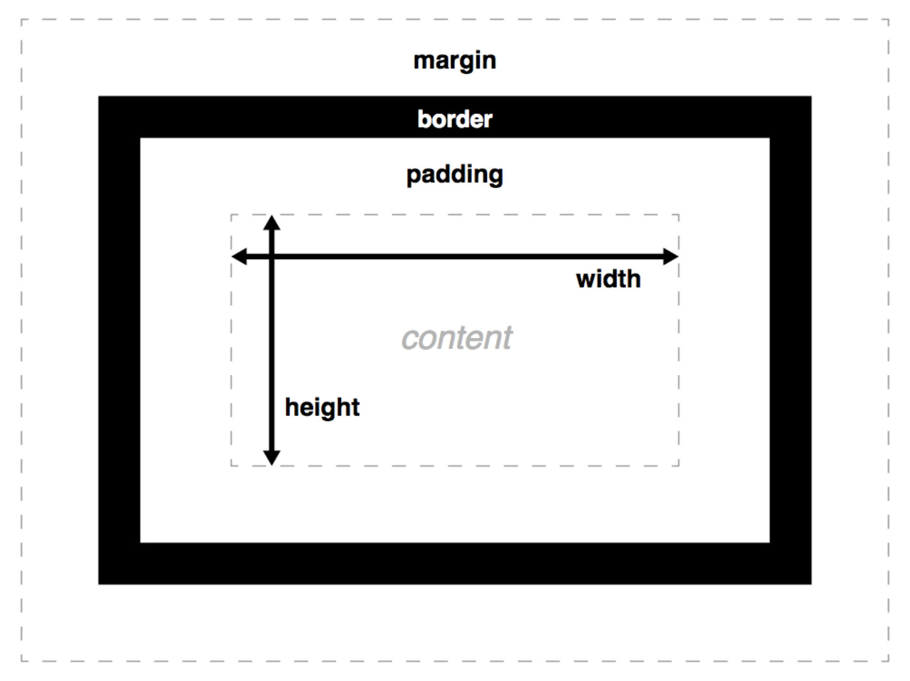

# 前端页面设计的基础思维：盒子模型

在前端工程师的眼里，可以说“万物皆盒子”。盒子模型是前端工程师将HTML和CSS结合起来，按照设计稿进行前端页面设计的一个“契合点”。“万变不离其宗”，前端页面布局的方法层出不穷，但不管它再怎么变化，一定是基于盒子模型的。掌握盒子模型的基础思维方式，有助于我们后面深入地学习响应式布局。下面我们就来系统的学习一下盒子模型。

一.显示属性

HTML元素有两种类型：块元素（block）和内联元素（inline）。这两种元素的区别主要是：块元素尽可能占据最大宽度而高度够用就好，可以通过`display:block`将元素设置为按块级元素显示；内联元素和内容一样宽，无法设置高度和宽度，但是可设置内外边距进行水平扩展，可以通过`display:inline`将元素设置为按内联元素显示。还有一种`display:inline-block`可以将元素设置为“行内块元素”，这样既可以像block元素一样设置宽高，又可以像inline元素一样行内显示。

二.盒子模型4要素

盒子模型将每一个元素组织成文档布局内的一个矩形框，从内（inside）向外（outside）分为4个组成部分，如下图所示：

content表示元素显示的内容，它被内部填充padding包裹起来，然后是元素的边界border，这三个要素共同组成盒子模型的inside部分，表示元素的内部，而外边距margin则表示元素和其他元素之间的距离，属于盒子模型的outside部分。如果我们把一个元素看作是一个人体的化，其实对于盒子模型我们可以这么理解：content表示人的骨架，它由血肉（padding）填充，border好比人的皮肤，人和人之间的距离就是外边距margin。通过这样形象的比喻，就能理解盒子模型的4个要素了。

三.决定元素大小的属性

box-sizing是决定元素大小计算方式的属性，它有两个值：border-box和content-box。如果选择了border-box，那么元素尺寸的值为content+padding+border三个部分，即元素实际尺寸已包含padding和border尺寸。content-box是默认设置，元素尺寸仅包含content，元素实际尺寸还要加上padding和border的尺寸，
		3.3 参考
			https://css-tricks.com/international-box-sizing-awareness-day/
			https://developer.mozilla.org/zh-CN/docs/Web/CSS/CSS_Box_Model/Introduction_to_the_CSS_box_model
	四.容器机制
		子元素的大小受到父元素的影响
		用百分比设置相对于父元素的大小
			只根据最近的父元素属性值进行计算
	五.使用语义元素
		5.1 好处
			避免div soup
			搜索引擎友好的
		5.2 基本分类
			内容分区
				适用于在页面上安排布局
			文本内容
				适用于文本
			内联文本语义
		5.3 HTML元素参考
			https://developer.mozilla.org/zh-CN/docs/Web/HTML/Element
	六.从视觉设计稿到网页
		6.1 比喻
			网站<--->房子
				HTML<--->墙体结构
				CSS<--->装修风格
				JS<--->交互式开关
		6.2 原理：HTML-CSS-DOM
			HTML
				浏览器翻译
					页面结构
						DOM
				样式
					CSS决定
		6.3 设计过程
			设计稿分解为盒子
				从最大方框开始，从大到小分割
				任何设计都转化为盒子
			编写基本框架结构
				先使用div
				替换为语义标记
				定义有意义的class
			构建HTML DOCTYPE
			进行视觉设计
				综合使用HTML和CSS
					修改和调整样式
						添加CSS样式
							匹配规则
								顺序
									浏览器默认样式
										不同浏览器样式稍有不同
									单独文件中样式表
										大多数时候使用的
										下方规则覆盖上方的
									HTML中的样式表
										在小型实战项目中可以这么做，但是不理想
									元素内联样式
										虽然也可以做，但应该避免
								specific
									最具体的规则生效
					对盒子进行布局
				调试技巧
					显示边框
						{\n  border: 1px solid red !important\n}
			增加可访问性
