# 现代JavaScript语言

这篇文章主要介绍如何编写面向对象的JavaScript。我们先从现代JavaScript语言的基本概念开始介绍，然后讲解this关键字。在有了这两个基础之后，我们将正式认识JavaScript语言中的面向对象编程：封装，继承和多态。这篇文章的第二部分将介绍ES6语法，其本质是语法糖，抹上一层语法糖会使得你的JS看起来更甜，这一部分也会介绍箭头函数，也就是其他编程语言中大名鼎鼎的Lambda表达式，但不会过多的涉及函数式编程的概念。最后，介绍异步的JavaScript，比如怎样使用JS向服务端发送异步请求，然后获得并处理结果。看完这篇文章后，你将对JavaScript这门编程语言有成体系化的理解。对于以后理解和掌握基于JS的其他语言，比如TypeScript都会很有帮助。

就让我们开始新的旅程吧！

# 一. 面向对象的JavaScript

基础概念部分将介绍几个重要的基本概念：作用域，执行上下文，闭包和this关键字。通过掌握作用域的知识，我们能够把握程序中什么变量在什么位置范围是有效的，而离开了那个范围之后就会失效。之后跟着一小段程序示例，我们一步一步推导执行上下文是怎么在内存中为变量建立内存模型的，弄清楚这两个概念就能够对编程有更深入的理解。最后，会介绍闭包(closure)这个稍微有点难理解的概念。搞懂这些概念对于学习任何编程语言都是有帮助的，你可以轻而易举地将在JS这里学到的知识迁移到其他任何编程语言中。this关键字是JS中另一个比较复杂的概念，也是用的不好容易出bug的地方，但只要我们在理解的过程中注意把握一个关键概念，很多看似纷繁复杂的东西就能迎刃而解。

在上述基本概念的基础上，我们将从封装，继承和多态入手，学习在JavaScript中进行面向对象编程的各种模式和技巧。乍一看很复杂，没有别的编程语言那么直观，但是不要担心，后面会有甜甜的语法糖来帮你减轻知识负担。

## 1.1 基础概念

### 1.1.1 作用域

JS中第一个重要的概念是作用域。在程序中可以通过变量名访问一个变量而不产生错误的区域，叫做这个变量的词法作用域。初始的作用域被称为全局作用域，任何在函数外面定义的变量，都具备全局作用域：

```javascript
var hero = aHero();
```

全局作用域是在多个js文件中共享的，也就是说在这个文件中访问另一个文件中定义的全局变量是完全合法的。在全局作用域的基础上，每次我们新定义一个函数，在这个花括号包围的函数体中就会创造出一个新的词法作用域。在这个词法作用域中定义的变量的生命周期就比全局作用域中的要小得多。这里要注意：1. 函数体中可以访问全局变量；2. 函数体可以访问在函数中定义的变量，但离开了函数体就不能被访问了；4. 如果所定义的变量a和全局作用域中的变量b重名，那么变量a就会覆盖掉变量b，直到离开函数所在的词法作用域。

在ES6语法出现之前，定义变量的最佳实践是使用var关键字，缺少var关键字变量会变成全局作用域：

```javascript
var hero = aHero();
var newSaga = function() {
  foil = afoil();
}
log(foil); // OK
```

这容易产生问题，因为此时foil自动变成全局变量，具有全局作用域，这将对阅读代码的人造成很大的困惑，所以在任何时候都要避免这样做。**一定要注意**，只有函数定义会创建新的词法作用域，条件和循环语句则不会，比如下面这段代码，在条件判断语句中定义的变量具有的是全局作用域，这是与其他编程语言不同的地方，要注意：

```javascript
var hero = aHero();
if (checkSomething()) {
  var foil = afoil();
}
log(foil); // OK
```

词法作用域是**静态**的概念，不用运行程序凭肉眼就能判断。一旦程序开始执行，解释器就会在内存中构建自己的存储系统存放变量名和对应的值，专业一点的说法叫**内存模型**。内存模型会形成自己的作用域，称为**执行上下文（execution context）**。不同于词法作用域，执行上下文是一边运行一边动态构建的，以下面这段代码为例，一步一步跟踪看看执行过程中解释器是怎么建立起执行上下文的：

```javascript
var hero = aHero();
var newSaga = function() {
  var foil = afoil();
  var saga = function() {
    var deed = aDeed();
    log(hero+deed+foil);
  };
  saga();
  saga();
}
newSaga();
newSaga();
```

在执行第一行代码之前，解释器会在内存中创建一个全局的执行上下文，对应全局作用域，因此都用浅绿色的区块来表示，如下图：


代码的前两行是变量定义，因此对应的执行上下文中会创建两个变量，hero变量指向字符串，newSaga变量指向一个函数定义，因为这里只是定义而没有执行，所以执行上下文会暂时忽略函数内部，而不会建立新的执行上下文，要记住，函数只有在执行的时候才会建立执行上下文。

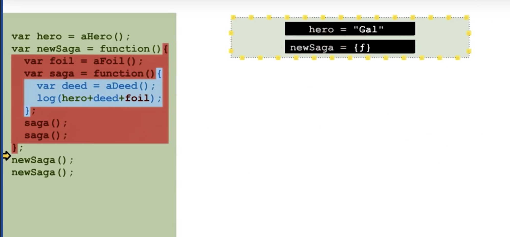
​			

当代码执行到第一个`newSaga()`时开始执行函数调用，此时内存中将为这个函数创建一个新的执行上下文，如下图中红色区块所示。我们来看一下当一行一行执行红色部分代码时，新的执行上下文是怎么一步一步创建起来的。


当执行函数中的代码时，变量的定义会在内存中建立起一一映射的模型，我们在`newSaga()`函数中定义了两个变量`foil`和`saga`，其中saga存储的是另一个新的函数定义。因此这里也将暂时忽略而不会在内存中创建新的执行上下文。

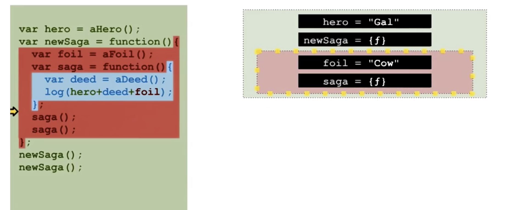

接着，开始执行`newSaga()`函数中的`saga()`函数，此时内存中新建了蓝色部分的新的执行上下文。定义变量`deed`时会在蓝色区块中建立相应的变量映射。

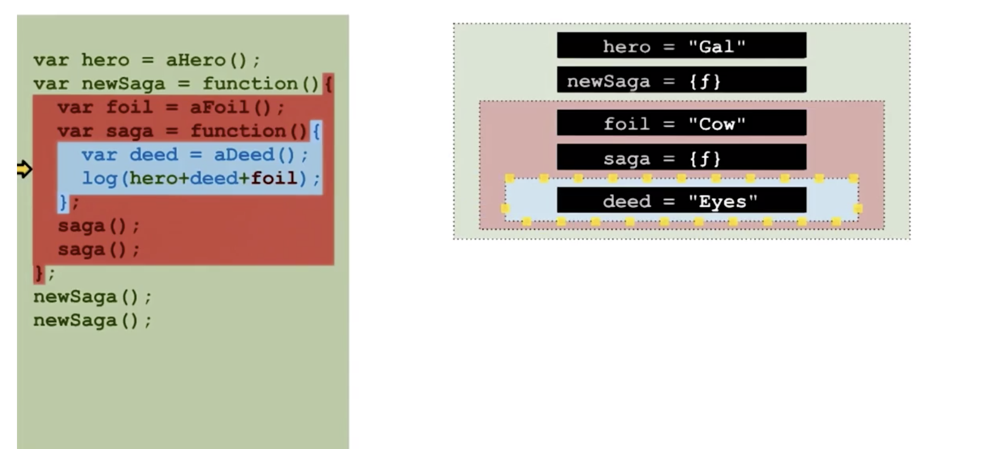

代码执行到`log(hero+deed+foil)`时，会由内向外查找变量的定义。先从蓝色的执行上下文中查找，发现找不到`hero`变量，于是向上一层，在红色部分查找，还是没有找到。最后再向上一层，在绿色部分找到了变量`hero`的定义。

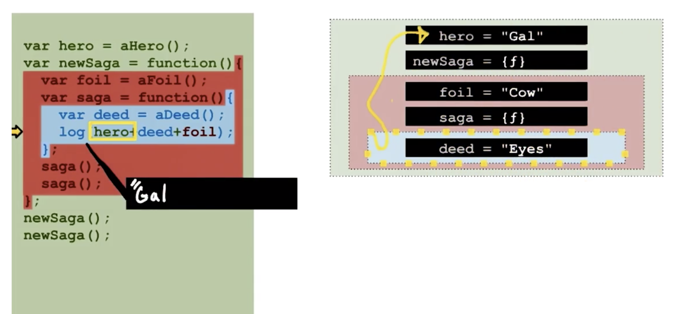

查找变量`deed`要容易一些，因为它的定义就在当前的执行上下文中，所以直接就能定位到了：

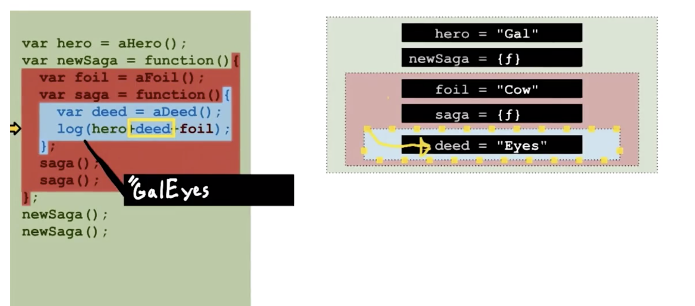

查找变量`foil`，需要向上一层在红色的执行上下文中找到：

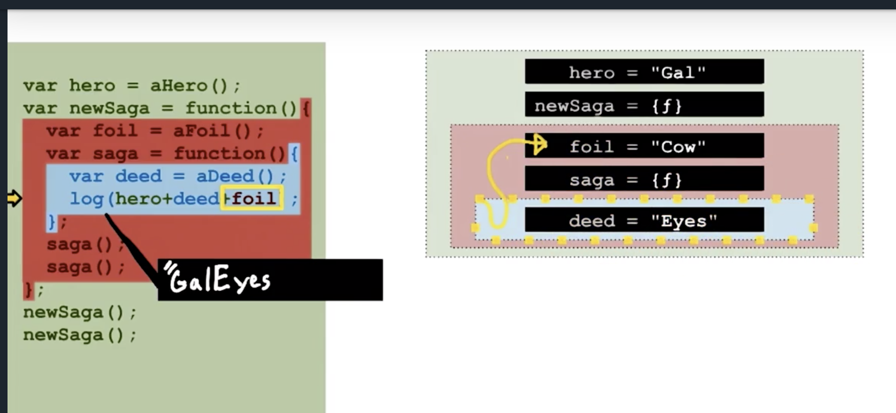

`log()`函数输出结果为"GalEyesCow"，第一个`saga()`函数调用执行完毕。


完成上面这些步骤，可能你还是没看出来词法作用域和执行上下文有什么区别。对比左右两张图，好像差不多都一样的，但是一旦开始执行第二个`saga()`函数调用，你就知道执行上下文不同于词法作用域的地方了。

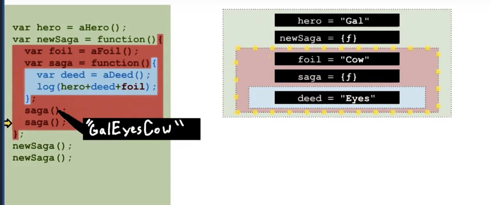

执行第二个`saga()`函数时，它会动态的创建新的执行上下文，与新的函数调用相对应。新的蓝色区块对应着第二次函数调用，它创建了一个新的`deed`变量，在内存中对应的值为"Tips"。

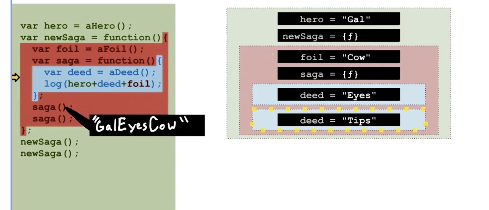

当再次执行到`log(hero+deed+foil)`函数调用时，仍然会重复上面的步骤，由内向外在不同的执行上下文中查找各变量的定义，并输出"GalTipsCow"。

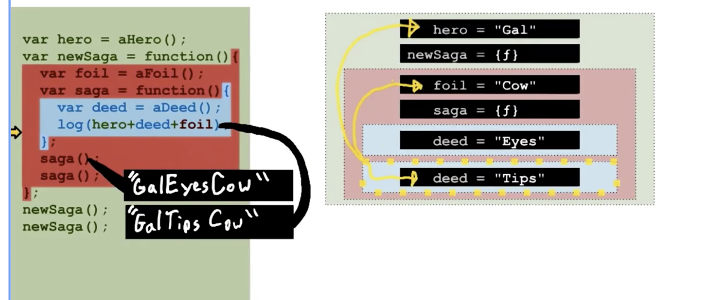

此时，第一个`newSaga()`函数算是执行完毕了，当我们再次执行第二个`newSaga()`函数时，就会重复上面的步骤，建立第二个红色+蓝色的执行上下文。

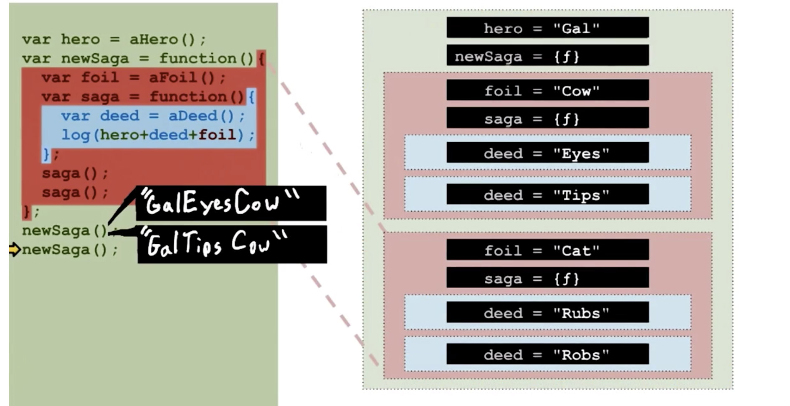

同样地，会输出"GalRubsCat"和"GalRobsCat"。注意这里的两个红色区块中都创建了诸如`foil`，`saga`和 `deed`等变量，但它们在内存中对应的值是不一样的。


通过单步执行来观察执行上下文的创建过程，我们能深入理解程序是如何执行的，也更能深刻理解变量是怎么被定位到的，关键就是要记住**每执行一次函数就会创建一个新execution context**。

### 1.1.2 闭包

闭包(Closure)是一个与作用域有关的高级概念。简单地说，就是能访问到其外围作用域变量的函数，此时外围作用域已经执行结束了。这个概念看起来有些复杂，但如果我们使用上面的执行上下文来观察代码的执行过程，就能弄懂它的核心原理，这里先记住一句话：**新context永远被创建在定义它的函数context中**。示例代码如下：

```javascript
var sagas = [];
var hero = aHero();
var newSaga = function() {
  var foil = aFoil();
  sagas.push(function() {
    var deed = aDeed();
    log(hero+deed+foil);
  });
};
newSaga();
sagas[0]();
sagas[0]();
newSaga();
sagas[0]();
sagas[1]();
sagas[0]();
```

还是老办法，我们自己来模拟一遍解释器执行代码的顺序。首先，解释器会在内存中建立全局执行上下文：

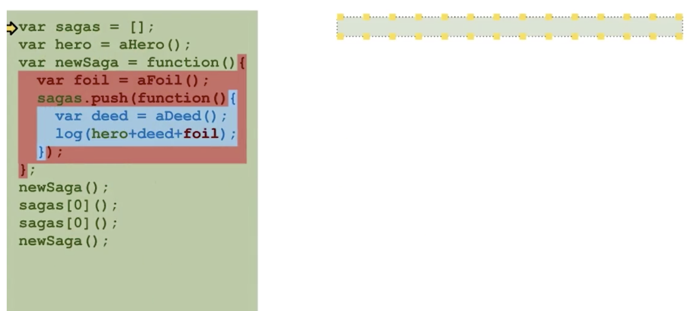

前两行定义变量，解释器会在内存中分别建立变量的映射关系。

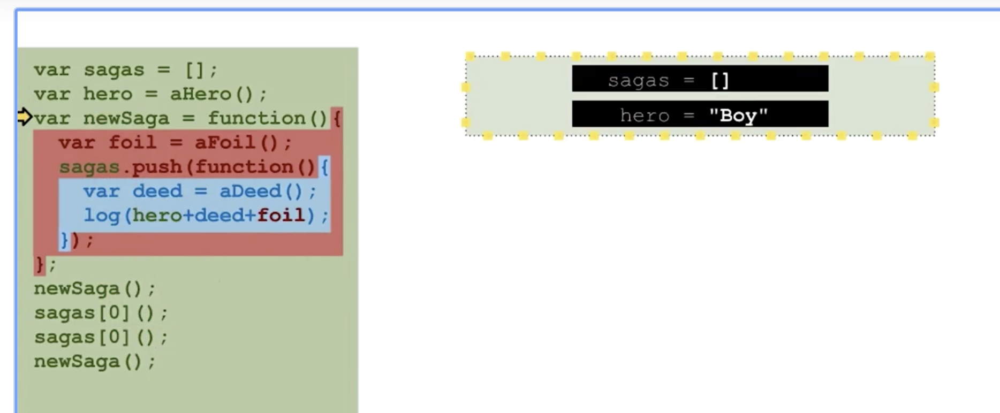

变量`newSaga`定义了一个函数体，在该函数体中定义了一个变量`foil`。然后向全局变量`sagas`数组中放入了一个函数对象。所以解释器会暂时忽略掉红色和蓝色部分，建立新的变量映射。

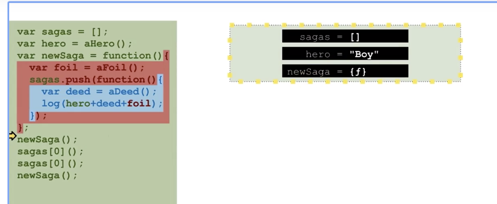

接下来正式调用`newSaga()`函数，函数在调用时会创建新的执行上下文，如下图中红色区块所示。

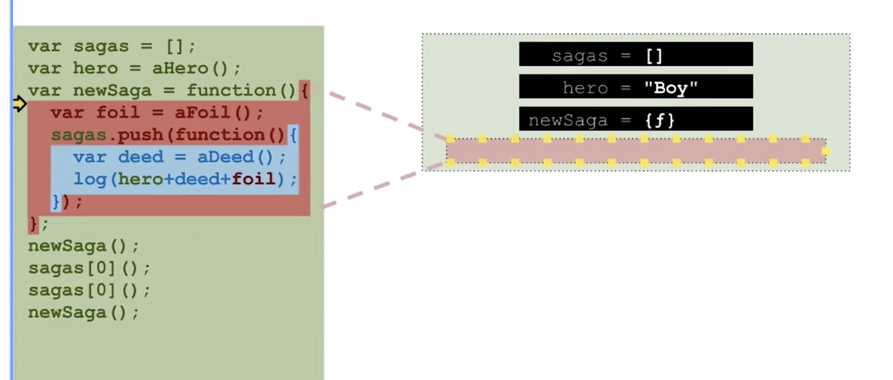

定义变量`foil`时，在红色区块的执行上下文中创建了变量映射。


接下来，将新创建的函数对象放入到sagas数组中，`newSaga()`函数执行结束。

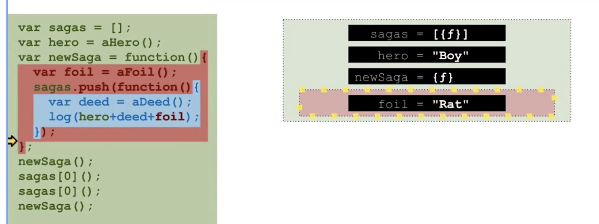

接下来，第一次执行函数对象`sagas[0]()`，创建蓝色区块表示的执行上下文。

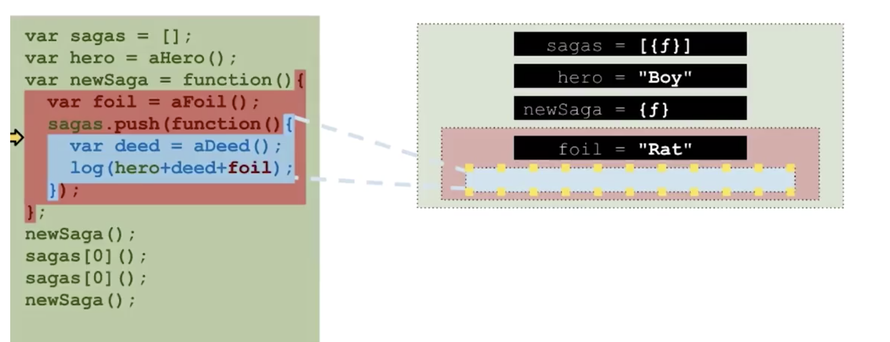

一旦我们定义变量`deed`，蓝色区块的执行上下文中就会建立对应的变量映射。

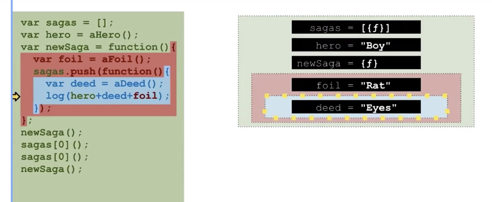

`log(hero+deed+foil)`函数会打印输出对应的值"BoyEyesRat"。

​	

当第二次执行`sagas[0]()`函数时，将创建新的执行上下文，如下图中第二个蓝色区块所示。

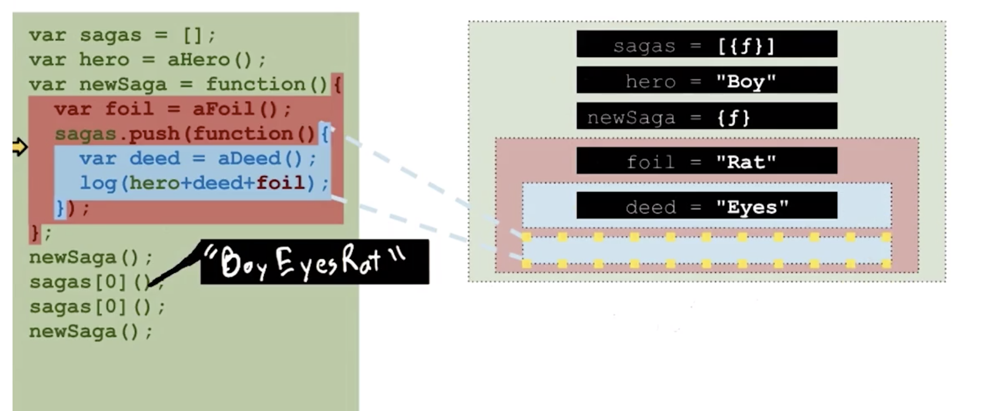

按照同样的函数执行流程，这里会建立新的`deed`变量的内存映射。然后打印输出"BoyDigsRat"。

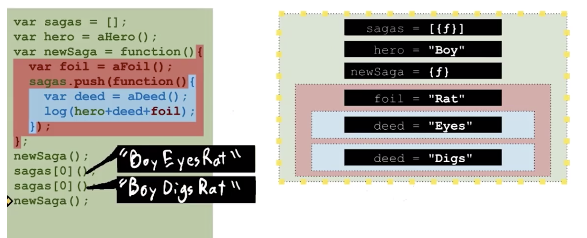

当我们第二次执行`newSaga()`函数时，会创建一个新的执行上下文，如下图中第二个红色区块所示。在这个红色区块中解释器建立了第二个`foil`变量的内存映射。	

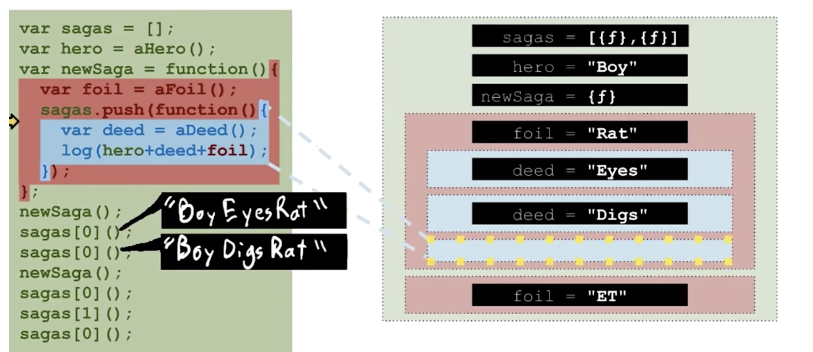

这个时候，如果我们再一次执行`sagas[0]()`函数会怎样？你觉得解释器会把它放到什么位置？其实和上面一样，解释器**一定会在原来定义它的执行上下文中创建新的执行上下文**，所以这里的函数调用仍然在第一个红色区块表示的执行上下文中创建了新的执行上下文，并将值为"Pins"的`deed`变量建立在里面，因为这个函数当初就是在这个执行上下文中被定义的，如下图所示。

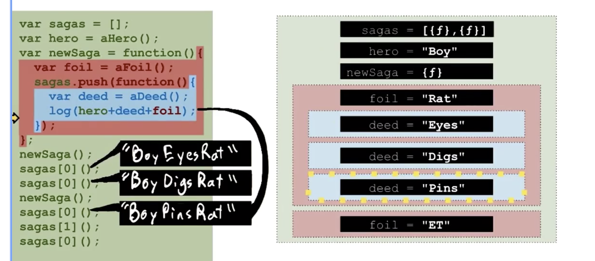

聪明的你肯定判断出来了，因为这里的`sagas[1]()`函数是在第二个红色区块表示的执行上下文中被创建的，因此这里的调用会在第二个红色执行上下文中创建新的执行上下文。

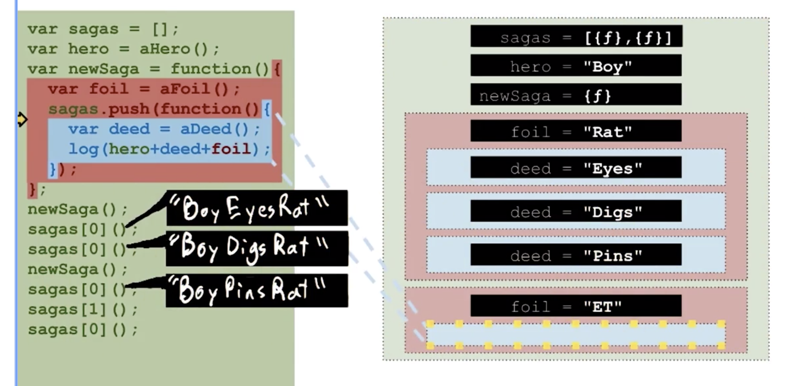

在新的蓝色执行上下文中，将创建新的变量`deed`，并得到值"Gets"，函数打印输出"BoyGetsET"。


最后一步再次执行了`sagas[0]()`，这个函数的执行仍然会在第一个红色区块表示的执行上下文中创建新的执行上下文，并创建新的变量`deed`，这次它的值为"Eats"。


所以最后这一次函数调用，将打印输出"BoyEatsRat"。

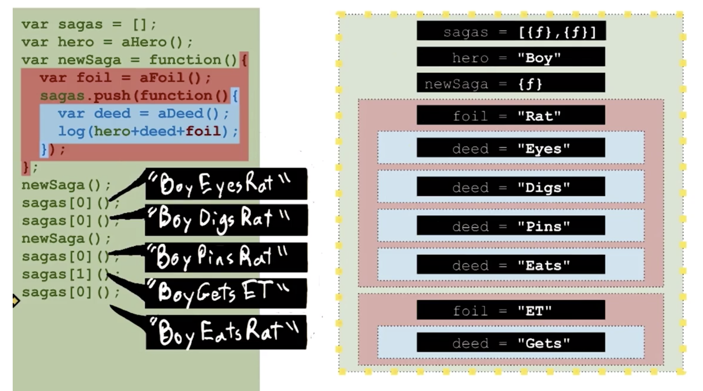

只要能把握"**解释器会在原来定义它的执行上下文中创建新的执行上下文**"这个核心，就能理解闭包这个概念。​

### 1.1.3 this关键字

每一个面向对象的编程语言都有一种方式来指定一个变量来表示当前对象。和很多编程语言一样，JavaScript使用this关键字来表示当前对象；和很多编程语言不一样，JavaScript的this关键字是一个很容易被误解的概念。把握一个关键概念this关键字绑定问题就好理解了：调用时确定。即**直到调用的那一刻（位置）才确定**，下面我们通过一个例子来看this绑定的7种规则。示例代码如下：

```javascript
var fn = function(one, two) {
  log(this, one, two);
};
var r={}, g={}, b={};
```

#### 1.1.3.1 规则一："the left of dot" rule

如果函数作为成员方法通过`obj.fn(x, y)`的方式调用，那么this关键字将绑定为obj对象。举例：

```javascript
r.method = fn;
r.method(g, b); // 此时this关键字被绑定为对象r
```

#### 1.1.3.2 规则二：直接调用

如果是下面这种情况就有意思了：

```javascript
fn(g, b);
```

答案是：this将被绑定为全局对象`<global>`，但如果是strict模式，则为`undefined`。

#### 1.1.3.3 规则三：fn.call(r, g, b)

如果对象r并没有叫fn的属性，我们是不能通过`r.fn()`的方式去访问的，这个时候可以使用`fn.call()`的形式，`call()`会重写调用规则，以下两种形式中this关键字的绑定规则都会被改写：

```javascript
fn.call(r, g, b); // this --> r
r.method.call(y, g, b); // this --> y
```

#### 1.1.3.4 函数作为回调传递给其他函数

如果将fn传递给`setTimeout()`函数又会怎么样呢：

```javascript
setTimeout(fn, 1000);
```

从这行代码仍然是看不出来的，我们的原则还是要从函数调用的那一刻进行判断，所以这里需要查看`setTimeout()`的源代码。

```javascript
var setTimeout = function(cb, ms) { // 这里只是setTimeout的模拟代码
  waitSomehow(ms);
  cb();
}
```

直接作为回调函数调用的话`one`和`two`没有绑定任何变量，所以是`undefined`。此时this关键字将被绑定为全局对象`<global>`。下面再看一种比较tricky的情况：

```javascript
setTimeout(r.method, 1000);
```

可能有人会觉得`method`方法是`r`对象的属性，这样传参this参数会不会和`r`有什么关系？答案是否定的，因为关键还是在函数被调用的那一刻来判断this的绑定，因此这里仍然是`<global>`全局对象，而且这里的参数`one`和`two`仍然被绑定为undefined，正确的做法应该是再增加一个函数对象，并在函数对象中进行方法调用：

```javascript
setTimeout(function() {
  r.method(g, b);
}, 1000);
```

此时this关键字绑定为`r`，`one`绑定为`g`，`two`绑定为`b`。而下面这种在全局作用域直接访问this关键字的行为，this将被绑定为`undefined`：

```javascript
log(this);
```

#### 1.1.3.5 规则五：new r.method(g, b)

```javascript
new r.method(g, b);
```

此时this关键字将因为`new`的作用而被绑定到一个后台自动创建的匿名对象上，因为每一次new都会生成新对象。

#### 1.1.3.6 规则六
fn.bind()创建新函数，this将永久地被绑定到了bind的第一个参数

#### 1.1.3.7 规则七

箭头函数根据当前上下文继承this

## 1.2 面向对象

其实你早就在JavaScript中用上对象了，只是你一直都没感觉到而已。JS这个编程语言和Python很像，都是**万物皆对象**的语言，甚至**函数本身也是一个特殊的对象**。我们将从面向对象的三大特性：封装，继承和多态来学习一下在JS中进行面向对象编程的各种方式以及它们的优劣。

### 1.2.1 封装

封装的本质其实是将数据和它们的访问者绑定到一起，形成一个类。这个类相当于一个模板，我们可以照着这个模板来创建一系列的实例，称为**对象**。在JavaScript中有6种类的封装模式：**对象修饰器**，**函数类**，**构造器模式**，**原型模式**，**原型类**和**伪类**。

#### 1.2.1.1 对象修饰器

我们先来看一种最简单和最直观的对象创建模式：**对象修饰器(object decorator)**。以一个小游戏为例，这个游戏中有很多车辆，玩家需要避开这些行驶中的车辆。这个游戏系统需要记录很多运动实体的数据。我们可以从游戏中的车辆入手进行代码编写。

```javascript
var amy = {loc: 1};
amy.loc++;
var ben = {loc: 9};
ben.loc++;
```

这么写代码可能会比较累，如果我们要创建很多对象，而这些对象看起来都差不多怎么办？不管用什么语言编写代码，我们一定要注意尽量**避免重复的代码**，一旦发现代码中出现重复的痕迹，就要及时着手重构：

```javascript
var move = function(car) {
  car.loc++;
};

var amy = {loc: 1};
move(amy);
var ben = {loc: 9};
move(ben);
```

看上去重构并没有什么明显的效果，我们虽然把重复的代码提取到一个函数中，但代码量似乎还增加了。这种提取重复代码的重构是不是没有意义呢？其实不是，它至少有两点好处。首先，如果你在开发的是一款真实的游戏，可能`move()`函数不会有这么简单，如果它很复杂怎么办？

```javascript
var move = function(car) {
  removeCarFromScreen(car.loc);
  addDustSwirlToScreen(car.loc);
  car.loc++;
  addCarToScreen(car.loc);
};
```

你不想每次都为汽车对象重复敲一遍上面的代码对吧；其次，如果你需要修改汽车移动的代码，那么只改一个地方是最好的了，如果代码散步在各个角落，你只要改漏一个地方，程序就可能会出bug。所以还是把重复代码提取到一个地方比较好。

除了`move()`函数，汽车对象的创建也是重复的代码，可以提取到一个我们称为修饰器的函数中。这里的`carlike()`函数传入两个参数，`obj`表示被修饰的对象，`loc`表示要修饰的内容，这个函数为obj对象添加了一个loc属性然后返回，相当于obj对象被"装饰"了一个新属性。

```javascript
var carlike = function(obj, loc) {
  obj.loc = loc;
  return obj;
};

var move = function(car) {
  car.loc++;
};

var amy = carlike({}, 1);
move(amy);
var ben = carlike({}, 9);
move(ben);
```

函数其实也是属性的一种，如果我们想用方法调用`amy.move()`的方式来调用`move()`函数，那么结合之前我们讨论过的this关键字绑定，上面的代码就还需要进一步重构。

```javascript
var carlike = function(obj, loc) {
  obj.loc = loc;
  obj.move = move
  return obj;
};

var move = function() {
  this.loc++;
};

var amy = carlike({}, 1);
amy.move();
var ben = carlike({}, 9);
ben.move();
```

注意，这里的`move`是一个函数对象，它作为属性被赋值给多个对象的move属性，在函数被调用的那一刻，this关键字会被绑定到不同的对象上。所以多个对象实际上共用一个move函数对象。但是，把一个函数成员定义在全局作用域而不是对象里面，多多少少看起来有些奇怪。看上去代码应该重构成下面这个样子比较好：

```javascript
var carlike = function(obj, loc) {
  obj.loc = loc;
  obj.move = function() {
    obj.loc++;
  };
  return obj;
};

var amy = carlike({}, 1);
amy.move();
var ben = carlike({}, 9);
ben.move();
```

但这么写代码会有一个乍一看不太容易发现的问题。原来我们是在全局作用域定义一个`move()`函数，然后把它赋值给对象修饰函数，所以被修饰过的对象都共用同一个函数对象，但现在我们把函数对象的定义放到了对象修饰函数中，这就会导致一个问题：每次我们通过调用`carlike()`函数去修饰对象时，都会在该函数作用域中创建一个新的函数对象。请注意，函数也是一种特殊对象，因此每次修饰得到的对象虽然`move()`方法是相同的，但在内存中却是不同的对象，如果创建了大量的汽车对象就会占用一些不必要的内存空间，是一种资源浪费。对于这个问题，对象修饰模式无法有效解决，我们还要想其他的办法。

#### 1.2.1.2 函数类

**函数（functional class）**类是一种可用于创建大量相似对象的强大函数，它是对上面讨论的对象修饰器的一种拓展，它使用函数将方法应用到任何对象身上。对象修饰模式是通过传入对象进行修饰实现的，函数类则自行创建对象，这样的函数被称为构造函数，通常以大写的形式表示，它创建的对象被称为实例。

```javascript
var Car = function(loc) {
  var obj = {loc: loc};
  obj.move = function() {
    obj.loc++;
  };
  return obj;
};

var amy = carlike({}, 1);
amy.move();
var ben = carlike({}, 9);
ben.move();
```

单纯的函数类并没有解决重复创建函数对象的问题，解决方法是将函数定义移到外面去，我们称它为**函数共享模式(functional shared pattern)**，其实上面已经见过这个方法了。

```javasc
var Car = function(loc) {
  var obj = {loc: loc};
  obj.move = move;
  return obj;
};

var move = function() {
    this.loc++;
};

var amy = carlike({}, 1);
amy.move();
var ben = carlike({}, 9);
ben.move();
```

这样写有个不好的地方就是每次定义新的函数，就先得在下面定义好函数体，然后再修改上面的构造函数，如果函数很多的话很容易忘记，比如下面这样的：

```javascript
var Car = function(loc) {
  var obj = {loc: loc};
  obj.move = move;
  obj.on = on;
  obj.off = off;
  return obj;
};

var move = function() {
    this.loc++;
};

var on = function() { /*...*/ }
var off = function() { /*...*/ }

var amy = carlike({}, 1);
amy.move();
var ben = carlike({}, 9);
ben.move();
```

有一种办法可以解决，就是将所有的函数定义放到`methods`对象中，然后使用`extend()`函数。这样每次添加新函数时只需要修改`methods`对象就可以了。

```javascript
var Car = function(loc) {
  var obj = {loc: loc};
 	extend(obj, methods);
  return obj;
};

var methods = {
  move: function() {
    this.loc++;
  }
};

var amy = carlike({}, 1);
amy.move();
var ben = carlike({}, 9);
ben.move();
```

但是把`methods`对象定义到全局作用域并不是一种很好的做法，况且不熟悉代码的人并不知道这里的methods到底要绑定给哪个对象。还记得前面说过，函数也是一种特殊的对象吗？这里我们可以把methods作为函数对象的属性进行存储，问题就解决了：

```javascript
var Car = function(loc) {
  var obj = {loc: loc};
 	extend(obj, methods);
  return obj;
};

Car.methods = {
  move: function() {
    this.loc++;
  }
};

var amy = carlike({}, 1);
amy.move();
var ben = carlike({}, 9);
ben.move();
```


​		三大特性
​			封装
​				本质
​					bundling of data and their accessors
​				机制
​					原始方式
​						要创建多个对象怎么办？
​							通过函数
​								object decorator
​									为对象添加新属性
​									缺点
​										函数多次拷贝
​								functional class
​									自己创建对象
​									创建新对象的特殊函数被称为类
​									缺点
​										函数多次拷贝
​										解决方案
​											functional shared pattern
​												将函数定义移到外面去
​												Constructor.methods
​								constructor pattern
​									new运算符
​									解释器构造
​										this = Object.create(Class.prototype);
​										return this;
​								prototype pattern
​									constructor func.prototype
​								prototype class
​									组合
​										functional class
​										prototype pattern
​								pseudo class
​									constructor pattern
​									prototype pattern
​			继承
​				本质
​					effective code reuse
​				机制
​					prototype chain
​						Object.create(obj)
​							create an empty object whose .prototype === obj
​						对象之间建立“链”式关联
​							顶层对象
​								Object.prototype
​									提供所有对象共享属性和方法
​									constructor
​							数组原型
​								Array.prototype
​				实现
​					functional class
​						抽取公共代码
​					pseudo class
​						构造子类
​							继承属性
​								.call()
​									calls a function with a given **this**
​									相当于其他语言中的Super()
​							继承方法
​								原型委托
​									Sub.prototype = Object.create(Super.prototype);
​							恢复子类构造函数
​								.prototype.constructor
​									Sub.prototype.constructor = Sub;
​							定义自己特有的方法
​			多态
​				本质
​					same interface but different implementaions
​				机制
​					prototype lookup
​						链式向上查找
​						一旦找到即停止回溯
​						instanceof运算符

# 二. ECMAScript 6

​	ES6语法
​		声明变量
​			var
​				存在hoisting
​					全局作用域
​					函数作用域
​				不再使用
​			let/const
​				{}块作用域
​				let
​					可以再次赋值
​					不可再次声明
​				const
​					不可再次赋值
​					不可再次声明
​		模板字面量
​			举例
​				let greetings = `Hello, my name is ${name}`;
​			换行符也被当做字面量一部分
​			${}强大功能
​				运算
​				调用函数
​				使用循环
​		解构
​			其实就是模式匹配
​			数组
​				const [x, y, z] = point;
​					可选择性忽略
​			对象
​				const {type, color, karat} = gemstone;
​		对象字面量简写
​			同名变量不必重复写
​			function关键字可省略
​		迭代
​			for..of循环
​				iterable protocol
​					String
​					Array
​					Map
​					Set
​		...运算符
​			展开运算
​				将Array和Set展开成单个元素
​					拼接数组
​						[...fruits, ...vegetables]
​			剩余参数
​				将不定数量的元素表示为数组
​				可变参数函数
​	ES6函数
​		箭头函数表达式
​			简练主体语法
​			块体语法
​			this关键字
​				取决于这个函数在代码中的位置
​				从周围上下文继承了this值
​		默认参数函数
​			解构
​				数组
​					function createGrid([width = 5, height = 5] = [])
​				对象
​					function createSundae({scoops = 1, toppings = ['Hot Fudge']} = {})
​		类
​			语法糖
​				函数
​				原型继承
​			继承关系
​				extends
​				super
​					既可当函数
​					又可当对象
​	ES6内置功能
​		符号类型
​			唯一标识符
​			常用于
​				唯一标识对象属性
​		迭代协议
​			iterable
​				自定义迭代行为
​				用于for..of
​				[Symbol.iterator]
​					返回
​						iterator
​			iterator
​				实现了next()函数的对象
​					0参
​					返回一个对象
​						done
​						value
​		Set
​			创建
​				new Set()
​			修改
​				add()
​				delete()
​				clear()
​			检查
​				has()
​				size
​			迭代
​				for..of
​				values()
​					SetIterator
​			WeakSet
​				只能包含对象
​				无法迭代
​				没有clear()
​				垃圾回收时自动删除
​		Map
​			创建
​				new Map()
​			修改
​				set()
​				delete()
​				clear()
​			检查
​				has()
​			迭代
​				MapIterator
​					keys()
​					values()
​				for..of
​				forEach()
​			WeakMap
​				只能以对象为键
​				无法迭代
​				没有clear()方法
​				垃圾回收时自动删除
​		Promise
​			异步执行的任务
​				状态
​					pending
​						fulfilled
​						rejected
​			执行完成通知
​				成功
​					resolve()
​				失败
​					reject()
​				执行回调
​					then()
​		Proxy
​			一个对象代表另一个对象
​				处理另一个对象所有交互
​			创建
​				new Proxy(被代理的对象, 处理程序)
​			处理程序
​				由各种trap组成
​		生成器
​			可暂停的函数
​				yield
​					向外面发送
​					从外面接收
​			function*
​	ES6专业开发者
​		Polyfill
​			修补功能，为浏览器提供支持
​				SVG
​				Canvas
​				网络存储
​					本地存储
​					会话存储
​				视频
​				HTML5 元素
​				无障碍功能
​				Web Sockets
​		Babel
​			转译器（transpiler）

HTML Canvas
	基础
	从像素到动画
		requestAnimationFrame

# 三. 异步的JavaScript

​	Promise
​		用途
​			try..catch wrapper for
​				unpredictable task
​					asynchronous
​					deferred
​		状态
​			pending
​				settled ONCE
​					fulfilled
​					rejected
​		使用
​			wrapping
​				封装异步任务
​					主线程执行
​						阻塞
​				new Promise(func)
​					func
​						resolve param
​						reject param
​			thening
​				fulfilled
​					resolve()
​				回调
​					action
​			catching
​				rejected
​					reject()
​				回调
​					recovering
​			链式调用
​				promises
​					forEach
​					map
​				Promise.all()
​					全部执行成功才算成功
​	AJAX
​		用途
​			异步获取数据
​				XML
​				JSON
​				HTML
​			无需更新全部页面
​		通过XHR
​			请求
​				new XMLHttpRequest()
​				.open()
​				.onload
​				.onerror
​				.send()
​			响应
​				.responseText
​		通过jQuery
​			.ajax()
​			便利方法
​				get()
​				getJSON()
​				getScript()
​				post()
​				load()
​		通过fetch
​			基于Promise